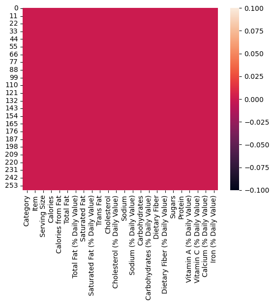
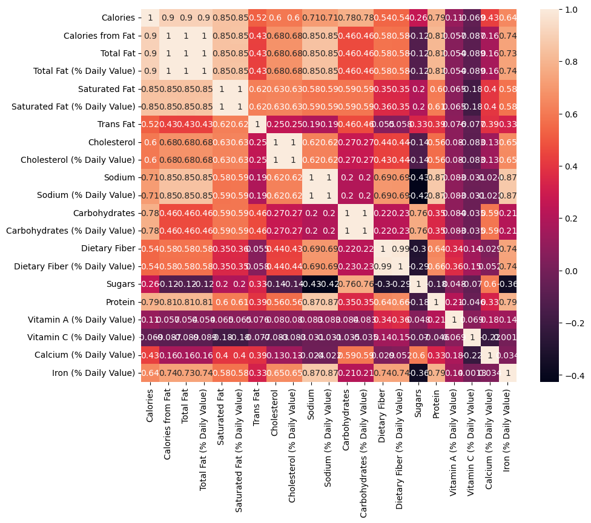

# Laporan Proyek Machine Learning
### Nama : Putri Adinda
### Nim : 211351112
### Kelas : Pagi B

## Domain Proyek

Protein adalah nutrisi yang berperan penting dalam proses metabolisme tubuh, memperbaiki sel tubuh, dan memproduksi sel baru. Guna memenuhi kebutuhan protein, terdapat beberapa makanan berprotein tinggi yang bisa dikonsumsi.Protein sangat penting bagi orang yang ingin menjaga organ tubuh tetap berfungsi dengan baik dan melindungi tubuh dari serangan penyakit.

## Business Understanding

Untuk orang-orang yang sangat menjaga kesehatan, mengetahui protein dari menu di McDonalds itu penting agar bisa membedakan dan tau mana yang berprotein baik dan mana susu yang berprotein buruk.

Bagian laporan ini mencakup:

### Problem Statements

- Orang-orang tidak dapat memprediksi protein menu di McDonalds.

### Goals

- Membuat penelitian dalam studi kasus protein dalam menu McDonalds untuk dapat memprediksi protein dalam menu McDonalds dengan model redresi linear.
- Mengetahui menu mana saja yang ada di McDonalds yang protein nya baik dan buruk.

### Solution statements
- Pengembangan Platform Pencarian Estimasi Protein dalam menu McDonalds Berbasis Web, Solusi pertama adalah mengembangkan platform pencarian Estimasi Protein dalam menu McDonalds Berbasis Web yang mengintegrasikan data dari Kaggle.com untuk memberikan pengguna akses cepat dan mudah ke informasi tentang estimasi protein dalam menu McDonalds. Platform ini akan menyediakan antarmuka pengguna yang ramah. 
- Model yang dihasilkan dari datasets itu menggunakan metode Linear Regression.

## Data Understanding
Dataset yang saya gunakan berasal jadi Kaggle yang berisi protein dalam menu McDonalds. Dataset ini mengandung 260 baris dan 25 columns.<br> 

[Nutrition Facts for McDonald's Menu](https://www.kaggle.com/datasets/mcdonalds/nutrition-facts).


### Variabel-variabel pada Apartment Prices for Azerbaijan Market adalah sebagai berikut:
- Category            : Menunjukkan dalam makanan. [Tipe data: String, Contoh: Breakfast, Beef & Pork]
- Item         : Menunjukkan nama menu.[Tipe data: String, Contoh: Egg McMuffin, Egg White Delight]
- Serving Size            : Menunjukkan jumlah ukuran porsi.[Tipe data: String, Contoh: 4,8 oz (136 g)]
- Calories            : Menunjukkan jumlah kalori.[Tipe data: Integer, Contoh: 300, 250, 370]
- Calories From Fat           : Menunjukkan jumlah kalori dalam lemak.[Tipe data: Integer, Contoh: 170, 70, 200]
- Total Fat           : Menunjukkan lemak.[Tipe data: Float, Contoh: 13, 8, 23]
- Total Fat (% Daily Value)            : Menunjukkan jumlah total lemak (% Nilai Harian).[Tipe data: Integer, Contoh: 20, 12, 35]
- Saturated Fat            : Menunjukkan jumlah lemak jenuh.[Tipe data: Float, Contoh: 5, 3, 8]
- Saturated Fat (% Daily Value)            : Menunjukkan jumlah lemak jenuh (% Nilai Harian).[Tipe data: Integer, Contoh: 25, 12, 45]
- Trans Fat            : Menunjukkan jumlah lemak trans.[Tipe data: Float, Contoh: 0, 1, 0.5]
- Cholesterol            : Menunjukkan jumlah kolesterol.[Tipe data: Integer, Contoh: 260, 25, 45]
- Cholesterol (% Daily Value)           : Menunjukkan jumlah kolesterol (% Nilai Harian).[Tipe data: Integer, Contoh: 87, 8, 15]
- Sodium           : Menunjukkan jumlah sodium.[Tipe data: Integer, Contoh: 750, 770, 780]
- Sodium (% Daily Value)           : Menunjukkan jumlah sodium (% Nilai Harian).[Tipe data: Integer, Contoh: 31, 32, 33]
- Carbohdyrates          : Menunjukkan jumlah karbohidrat.[Tipe data: Integer, Contoh: 31, 30, 29]
- Carbohdyrates (% Daily Value)           : Menunjukkan jumlah karbohidrat (% Nilai Harian).[Tipe data: Integer, Contoh: 10, 13, 14]
- Dietary Fiber          : Menunjukkan jumlah serat makanan.[Tipe data: Integer, Contoh: 4, 3, 2]
- Dietary Fiber (% Daily Value)          : Menunjukkan jumlah serat makanan (% Nilai Harian).[Tipe data: Integer, Contoh: 17, 18, 7]
- Sugars          : Menunjukkan jumlah gula.[Tipe data: Integer, Contoh: 3, 2, 4]
- Protein          : Menunjukkan jumlah protein.[Tipe data: Integer, Contoh: 17, 18, 14]
- Sugars          : Menunjukkan jumlah gula.[Tipe data: Integer, Contoh: 3, 2, 4]
- Vitamin A (% Daily Value)          : Menunjukkan jumlah vitamin A (% Nilai Harian).[.[Tipe data: Integer, Contoh: 10, 6, 8]
- Vitamin C (% Daily Value)          : Menunjukkan jumlah vitamin C (% Nilai Harian).[.[Tipe data: Integer, Contoh: 0, 2, 8]
- Calcium  (% Daily Value)          : Menunjukkan jumlah vitamin A (% Nilai Harian).[.[Tipe data: Integer, Contoh: 25, 30, 15]
- Iron (% Daily Value)          : Menunjukkan jumlah besi (% Nilai Harian).[.[Tipe data: Integer, Contoh: 15, 8, 10]

## Data Preparation
### Data Collection
Untuk data collection ini, saya mendapatkan dataset yang nantinya digunakan dari website kaggle dengan nama dataset Nutrition Facts for McDonalds Menu. Datasetnya bisa di download pada link diatas.

### Data Discovery And Profiling
Untuk bagian ini, kita akan menggunakan teknik EDA. <br>
Pertama kita mengimport semua library yang dibutuhkan, 
``` bash
import pandas as pd
import numpy as np
import matplotlib.pypot as plt
import seaborn as sns
```

Karena kita menggunakan google colab untuk mengerjakannya maka kita akan import files juga,
``` bash
from google.colab import files
```

Lalu mengupload token kaggle agar nanti bisa mendownload sebuah dataset dari kaggle melalui google colab
``` bash
file.upload()
```
Setelah mengupload filenya, maka kita akan lanjut dengan membuat sebuah folder untuk menyimpan file kaggle.json yang sudah diupload tadi
``` bash
!mkdir -p ~/.kaggle
!cp kaggle.json ~/.kaggle/
!chmod 600 ~/.kaggle/kaggle.json
!ls ~/.kaggle
```
Done, lalu mari kita download datasetsnya
``` bash
!kaggle datasets download -d mcdonalds/nutrition-facts
```
Selanjutnya kita harus extract file yang tadi telah didownload
``` bash
!mkdir nutrition-facts
!unzip nutrition-facts.zip -d nutrition-facts
!ls nutrition-facts
```
Mari lanjut dengan memasukkan file csv yang telah diextract pada sebuah variable, dan melihat 5 data paling atas dari datasetsnya
``` bash
df = pd.read_csv('nutrition-facts/menu.csv')
df.head()
```
Untuk melihat mengenai type data dari masing masing kolom kita bisa menggunakan property info,
``` bash
df.info()
```
Selanjutnya kita akan memeriksa apakah datasetsnya terdapat baris yang kosong atau null dengan menggunakan seaborn,
```  bash
sns.heatmap(df.isnull())
```
 <br>

Mari kita lanjut dengan data exploration kita,
``` bash
plt.figure(figsize=(10,8))
sns.heatmap(df.corr(), annot=True)
```


Mari lanjut dengan modeling.

## Modeling
sebelumnya mari kita import library yang nanti akan digunakan,
``` bash
from sklearn.model_selection import train_test_split
from sklearn.linear_model import LinearRegression
```
Langkah pertama adalah memasukkan kolom-kolom fitur yang ada di datasets dan juga kolom targetnya,
 ``` bash
features = ['Total Fat', 'Saturated Fat', 'Sugars', 'Cholesterol', 'Sodium', 'Calories', 'Carbohydrates']
x = df[features]
y = df['Protein']
x.shape, y.shape
 ```
Selanjutnya kita akan menentukan berapa persen dari datasets yang akan digunakan untuk test dan untuk train, disini kita gunakan 20% untuk test dan sisanya untuk training alias 80%
``` bash
X_train, X_test, y_train, y_test = train_test_split(x, y, test_size=0.2, random_state=42)
```
Mari kita lanjut dengan membuat model Linear Regressionnya
``` bash
model = LinearRegression()
```
Mari lanjut, memasukkan x_train dan y_train pada model dan memasukkan value predict pada y_pred,
``` bash
from sklearn.model_selection import train_test_split
x_train, x_test, y_train, y_test = train_test_split(x, y, random_state=70)
y_test.shape
```
Sekarang kita bisa melihat score dari model kita,
``` bash
score = lr.score(x_test, y_test)
print('akurasi model regresi linier =', score)
```
Score model nya yaitu 98%, selanjutnya mari kita test menggunakan sebuah array value.
``` bash
#Total Fat=8, Saturated Fat=3, Sugars=3, Cholesterol=25, Sodium=770, Calories=250, Carbohdyrates=30
input_data = np.array([[8, 3, 3, 25, 770, 250, 30]])

prediction = lr.predict(input_data)
print('Estimasi kalori dalam Egg White Delight McDonalds :', prediction)
```
Sekarang modelnya sudah selesai, mari kita export sebagai sav agar nanti bisa kita gunakan pada project web streamlit kita.
``` bash
import pickle

filename = "estimasi_protein.sav"
pickle.dump(model,open(filename,'wb'))
```


## Evaluation
Disini saya menggunakan R2 score sebagai metrik evaluasi.
- R-squared (R2) adalah ukuran statistik yang mewakili proporsi varians suatu variabel terikat yang dijelaskan oleh variabel bebas dalam model regresi.

``` bash 
from sklearn.metrics import r2_score
r2_DT = r2_score(y_test, pred)  
r2_DT

print(f"Precision = {r2_DT}")
```
Hasil di dapatkan adalah 98%, yang artinya variable dependen
dan variable independen berkolerasi tinggi.

## Deployment

[Estimasi Protein Menu McDonald](https://app-estimasi-protein-giutfqlbvjevjdp2ux6bnw.streamlit.app/).
